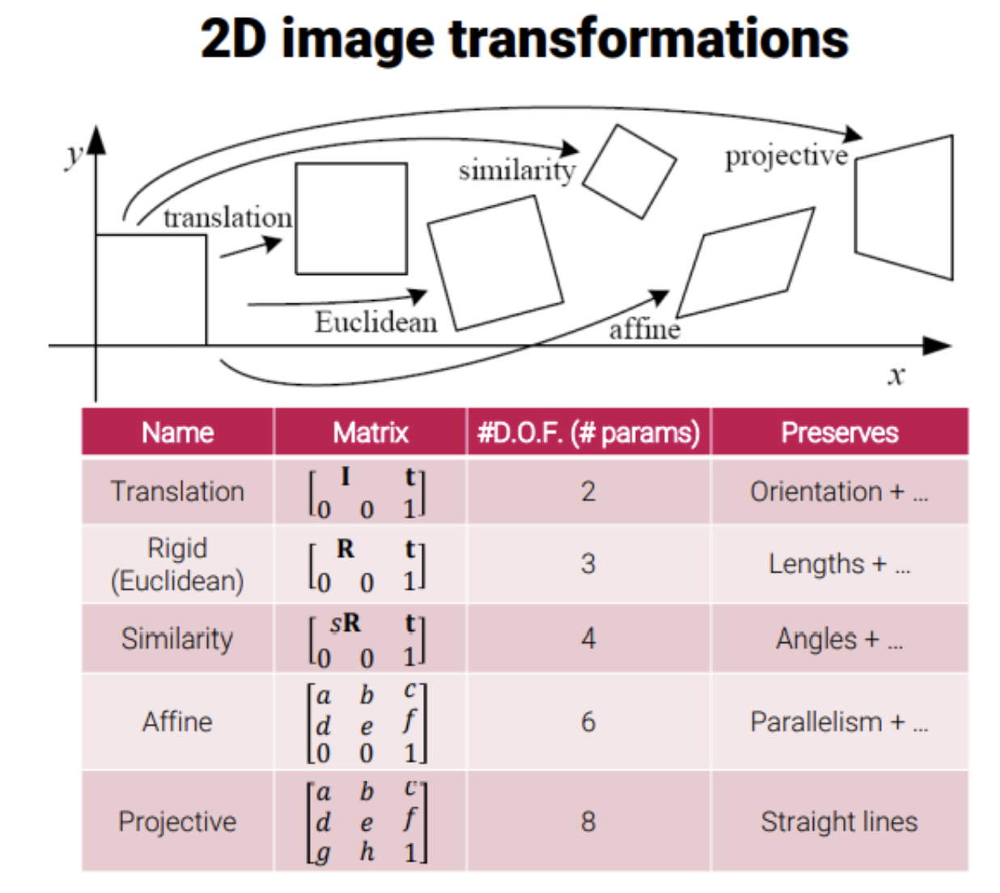

#### 2.4 변환계층 p71
이 장에서는 사영변환의 중요한 분화(specialization)와 기하학적 속성에 대해 설명한다. 
- 실수 원소를 가지는 nxn 가역 행렬군은 n차원 일반 선형군이다. 
- 몫군(group)을 얻을 수 있는데, 군이라는 것은 행렬안에서 scale군, rotation군, translation군
- 또한, 마지막이 1인 0,0,1인 아핀군이 있다. 
- rotation같은 것들은 유클리드군이다.
##### 불변량
- 점 또는 곡선의 좌표에 작용하는 행렬이 보존하는 요소나 수량인 불변량을 이용해 변환을 설명하는 것
- 기하 구성의 불변은 특정 변환을 해도 값이 변경되지 않는 구성의 함수다.

#### 2.4.1 분류 1: 등거리 사상
등거리 사상(isometry)은 유클리드 거리를 유지하는 평면 R2의 변환이다.

- 유클리드 변환은 강체(rigid object)의 운동을 모델링한다. (Rigid Transform)
- 평면 유클리드 변환은 다음과 같이 블록 형식으로 더 간결하게 표현할 수 있다.
R t
0T 1 곱하기 x

- RTR = RRT = I 
- Rotation을 한 후 다시 원위치 하면 I가 됨. 자기 자신
- 0은 2차원 영벡터

 
- 평면 유클리드 변환은 자유도 3을 가진다. 회전이 1, 이동이 2이다.
그러므로 변환을 정의하려면 세 개의 매개변수를 지정해야 한다. 

##### 군과 방향
- 등거리 사상은 왼쪽 위의 2x2 행렬이 행렬식 1을 가지면 방향을 보존한다. 
방향을 유지하는 등거리 사상은 군이 되지만, 방향을 반전하는 등거리 사상은 그렇지 않다. 

#### 2.4.2 닮은 변환 (similarity transform)
- 등방향 배율 조정으로 구성된 등거리 사상이다. s (scale) 값이 들어감. 2x2에 (1,1) ~ (2,2)까지
- Similarity transform은 자유도 4를 가지며, 유클리드 보다 더 많은 자유도를 가진다. 

##### 불변량
- 직선사이의 각도는 회전, 평행 이동 또는 등방성 배율 조정에 영향을 받지 않으므로 닮은 변환의 불변량이다. 
- 평행선은 평행선으로 변환된다. 

#### 2.4.3 아핀변환
- 이동이 뒤따르는 선형 정칙 변환이다. 
- 아핀변환은 R|t 6개의 행렬 원소에 해당하는 자유도를 가진다. 
- 아핀행렬 A는 회전과, x y뱡향으로 각각 l1, l2만큼 배율 조정 그리고 역회전 후에 또 다른 회전의 연결이다. 
##### 불변량
비등방 배율 조정을 포함하기에 닮은 변환에서 보존하는 길이 비율과 선 사이의 각도는 아핀변환에서 보존되지 않는다. 
 
불변량 세 개는 다음과 같다.

###### 1. 평행선
평행한 두 직선은 무한점 (x1, x2, 0)T에서 교차한다. 
아핀변환은 이 점을 다른 무한점으로 보낸다. 그렇기 때문에
변환 후에 여전히 평행하다. 

###### 2. 평행 선분의 길이 비율
선분의 길이 배율은 선 방향과 배율 조정 방향 사이의 각도에만 의존한다. 

###### 3. 면적 비율
회전과 이동은 면적에 영향을 주지 않으므로, l1, l2에 의한 배율 조정만이 중요하다.

#### 2.4.4 사영변환

사영변환은 동차 좌표의 일반적인 정칙 선형변환이다. (정칙, 가역은 역행렬을 갖는 행렬)
이것은 비동차 좌표의 일반적인 정칙 선형변환과 이동의 합성인 아핀변환을 일반화한 것이다. 
자유도는 자유도는 9개의 매개변수로 결정된다.
 
- 두 평면 사이의 사영변환은 점 4개의 대응으로 계산할 수 있다. 
이 때 두 평면에서 3개의 점이 동일선상에 있어서는 안된다.
아핀변환과 달리 P2에서는 방향 유지와 방향 반전 사영변환을 구분할 수 없다. 

##### 불변량
동일선에 놓여 있는 4개의 점의 교차 비율이다.
선의 길이 비율은 아핀변환에서 불변량이지만 사영변환에서는 그렇지 않다. 
길이의 비율의 비율, 즉 교차 비율은 사영불변이 된다. 

 

사영 변환은 마지막 원소가 0이 아닌 1이기 때문에 비선형 효과가 발생한다. 
이상점 (x1, x2, 0)T의 아핀변환과 사영변환과 비교한다. 
아핀변환에서는 이상점이 이상점으로 남아 있다. (즉, 무한대)
사영변환에서는 이상점이 유한한 점으로 변환된다. 
이 성질을 이용해 소실점을 모델링하는 것에 사영변환을 사용한다. 

#### 2.4.6 사영변환의 분해

